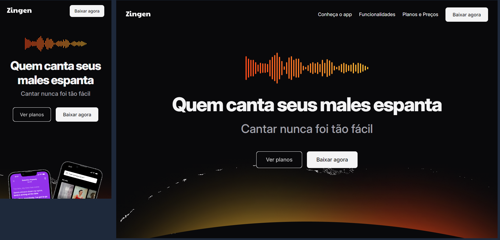

# Zingen App 🎤

**Zingen App** é um projeto acadêmico desenvolvido durante o curso de Full Stack pela Rocketseat, sob a orientação do tutor Mayk Britto. O objetivo é criar uma plataforma de karaokê que utiliza Inteligência Artificial para remover vozes originais de músicas, permitindo que os usuários cantem com acompanhamento instrumental. O projeto também inclui funcionalidades como avaliação de performance, gravação de áudio e vídeo, e uma experiência gamificada.

---

## 🛠️ Tecnologias Utilizadas

- **HTML5**: Estrutura semântica do formulário.
- **CSS3**: Estilização avançada com variáveis CSS e flexbox/grid.
- **VS Code**: Editor .❤.
- **Figma**: Design do Projeto.
- **Git**: Versionamento.
- **Vercel**: Deploy.
- **Design Responsivo**: Layout adaptável para dispositivos móveis e desktop.
- **Fontes Personalizadas**: Google Fonts (Inter).
- **Ícones e Imagens**: SVG e PNG para uma experiência visual rica.

---

## 📥 Como Executar o Projeto

1. **Clone o repositório**:

   ```bash
   git clone https://github.com/seu-usuario/zingen-landing-page.git
   ```

2. **Abra o projeto**:
   - Navegue até a pasta do projeto:

     ```bash
     cd zingen-landing-page
     ```

   - Abra o arquivo `index.html` no seu navegador.

---

## 🛠️ Estrutura do Projeto

```plaintext
zingen-landing-page/
├── assets/
│   ├── icons/          # Ícones utilizados no projeto
│   └── image/          # Imagens ilustrativas
├── css/
│   │    ├── about.css      # Estilos específicos para section about
│   │    ├── buttons.css    # Estilos específicos para os butoes
│   │    ├── cards.css      # Estilos específicos para cards
│   │    ├── download.css      # Arquivo central
│   │    ├── features.css      # Estilos específicos para os features
│   │    └── styles.css        # Estilos 
│   ├── global.css              # root
│   ├── footer.css              # Estilo do footer
│   ├── social.css              # Estilo para icons de midias
│   └── etc ...         # Arquivos de estilos
├── index.html          # Página principal do projeto
└── README.md           # README.md
```

---

## 📚 Contexto Acadêmico

Este projeto foi desenvolvido como parte do curso da **Rocketseat**, sob a orientação do tutor **Mayk Britto**. O objetivo principal é praticar conceitos de desenvolvimento frontend, como:

- Estruturação semântica com HTML.
- Estilização avançada com CSS.
- Design responsivo.
- Boas práticas de organização de código.

---

## 📄 Licença

Este projeto é de cunho acadêmico e não possui licença específica. Sinta-se à vontade para utilizá-lo como referência para seus estudos.

---

## 🙌 Agradecimentos

- **Rocketseat**: Pelo incrível conteúdo e suporte.
- **Mayk Britto**: Pela orientação e dicas valiosas durante o desenvolvimento.

---
## 🌐 Links

Se tiver alguma dúvida ou sugestão, entre em contato:

- **E-mail**: [devmoisessantos@gmail.com]
- **GitHub**: [devmoisessantos](https://github.com/devmoisessantos)
- [**Veja aqui**]())

---

Feito com ❤️ por Moises M Santos. 👋
© 2025 Desenvolvido como parte do curso Desenvolvedor Full Stack.
